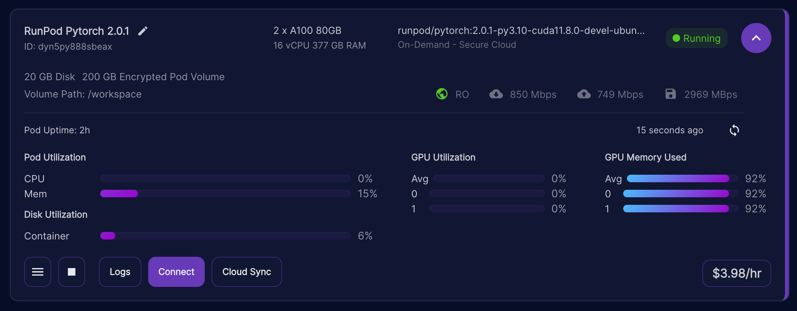

# async_summarize
An asynchronous summarization script.

```shell
$ ./main -f file.txt
```
* this script will try to summarize file.txt using the parameters defined in config.yaml
* if the input is too long, it will be split recursively, with overlap
* `httpx_max_connections` and `httpx_max_keepalive_connections` allow to control the number of simultaneous HTTP connections towards your API

```yaml
---
httpx_max_keepalive_connections: 1
httpx_max_connections: 1
use_fast: true
use_batched_tokenization: true
chunk_size: 3000
chunk_overlap: 512
# api_url: http://localhost:4999/v1
api_url: http://ultraforce:5000/v1
# api_url: http://localhost:8000/v1
api_key: empty
model_identifier: jondurbin/airoboros-m-7b-3.1.2
max_tokens: 1000
temperature: 0.2
```

# Features

## Tokenizer Parallelism
* The script enables Rust-based tokenizer parallelism by using Huggingface transformers fast tokenizers.
* To do so, the script is written with respect to the needs of tokenizer parallelism and is meant to be safe to run with `TOKENIZERS_PARALLELISM` set to `true`.

### Example
```shell
$ export TOKENIZERS_PARALLELISM=true
$ ./main -f file.txt
```

### References
* GitHub transformers Issue [Tokenizers throwing warning "The current process just got forked, Disabling parallelism to avoid deadlocks.. To disable this warning, please explicitly set TOKENIZERS_PARALLELISM=(true | false)" #5486](https://github.com/huggingface/transformers/issues/5486#issuecomment-654232343)
* Stack Overflow, [How to disable TOKENIZERS_PARALLELISM=(true | false) warning?](https://stackoverflow.com/questions/62691279/how-to-disable-tokenizers-parallelism-true-false-warning/72926996#72926996), written Jul 10, 2022

## Batched Tokenization
* The script enables batched tokenization using Huggingface transformers fast tokenizers.
* The tokenization computations are cpu-bound and very expensive. this feature uses batching to speed up the tokenization process, which is required for the chunk length computations inside the langchain text splitter class.

### Help to get the PR running in a Python .venv quickly

* using GitHub client and poetry to build and install the langchain PR #5583 directly into your async_summarize .venv

```shell
$ gh repo clone langchain-ai/langchain
$ cd langchain
$ gh pr checkout 5583
$ cd langchain/libs/langchain
$ ln -sf <the .venv of your async_summarize> .venv
$ poetry build
$ poetry install
```

### References
* Huggingface NLP Course, [Chapter: Fast tokenizers' special powers
](https://huggingface.co/learn/nlp-course/chapter6/3#fast-tokenizers-special-powers)
* GitHub Pull Request langchain-ai [Batched length functions for text splitters #5583
](https://github.com/langchain-ai/langchain/pull/5583)
* GitHub Issue langchain-ai [Split by Tokens instead of characters: RecursiveCharacterTextSplitter #4678
](https://github.com/langchain-ai/langchain/issues/4678)

# Example Run 1 without Tensor Parallelism
* In this example Oobabooga text-generation webui was used, which does not implement tensor parallelism, so httpx connections is set to 1, in order to sequence the LLM requests.
* Tokenization/client was a macBook Pro 15-inch 2018, Sonoma 14.1.1, Intel® Core™ i9-8950HK Processor, 6 core, 32 GB RAM.
* Inference/server was a oobabooga (commit `f889302d2427c03a3c15925dd097c6213845660c`) on Windows 10, RTX 3090, Cuda 12.1.1, transformers 4.35.2.
* Sample Text [Frankenstein; Or, The Modern Prometheus by Mary Wollstonecraft Shelley](https://www.gutenberg.org/ebooks/84)

```text
$ poetry run ./main.py \
    -c config-jondurbin_airoboros-m-7b-3.1.2.yaml \
    -p prompt-airoboros-default-summarize-130.yaml \
    -f pg84.txt
None of PyTorch, TensorFlow >= 2.0, or Flax have been found. Models won't be available and only tokenizers, configuration and file/data utilities can be used.
ic| buck_slip_filename: 'config-jondurbin_airoboros-m-7b-3.1.2.yaml'
Reading... ━━━━━━━━━━━━━━━━━━━━━━━━━━━━━━━━━━━━━━━━ 351/351 bytes 0:00:00
ic| buck_slip: {'api_key': 'empty',
                'api_url': 'http://ultraforce:5000/v1',
                'chunk_overlap': 512,
                'chunk_size': 3000,
                'httpx_max_connections': 1,
                'httpx_max_keepalive_connections': 1,
                'max_tokens': 1000,
                'model_identifier': 'jondurbin/airoboros-m-7b-3.1.2',
                'temperature': 0.2,
                'use_batched_tokenization': True,
                'use_fast': True}
ic| prompt_template_filename: 'prompt-airoboros-default-summarize-130.yaml'
Reading... ━━━━━━━━━━━━━━━━━━━━━━━━━━━━━━━━━━━━━━━━ 137/137 bytes 0:00:00
ic| prompt_template: ('BEGININPUT
                     '
                      '{{ prompt }}
                     '
                      'ENDINPUT
                     '
                      'BEGININSTRUCTION
                     '
                      'Summarize the input in about 130 words.
                     '
                      'ENDINSTRUCTION')
ic| type(tokenizer): <class 'transformers.models.llama.tokenization_llama_fast.LlamaTokenizerFast'>
ic| tokenizer.is_fast: True
ic| type(encoding): <class 'transformers.tokenization_utils_base.BatchEncoding'>
ic| encoding.is_fast: True
ic| type(text_splitter): <class 'langchain.text_splitter.RecursiveCharacterTextSplitter'>
ic| batched_tokenization: True
ic| type(api_client): <class 'openai.AsyncOpenAI'>
ic| input_filename: 'pg84.txt'
Reading... ━━━━━━━━━━━━━━━━━━━━━━━━━━━━━━━━━━━━━━━━ 449.0/449.0 kB 0:00:00
ic| len(sample_text): 438838
ic| output_filename: 'pg84-analysis-jondurbin_airoboros-m-7b-3.1.2-0000.json'
ic| 'Init complete.'
ic| recursion_depth: 1
ic| len(chunks): 47
ic| recursion_depth: 2
ic| recursion_depth: 2
ic| recursion_depth: 2
[...]
```

* The resulting JSON looks like this:

```shell
$ jq . < pg84-analysis-jondurbin_airoboros-m-7b-3.1.2.json
{
  "summary": "Robert Walton, a man with extraordinary imagination embarks on a journey to the North Pole. Edward, a young man of remarkable scientific mind sails with Walton. Along the journey, they encounter harsh weather conditions the include extreme cold which causes the ship's sails to freeze. In desolation, they hear a man calling out for help and they meet a monster that is actually Frankenstein's creature. The creature tells his story, which includes his inability to find companionship and loneliness, which eventually drove him to kill. When Walton reaches the Pole he sends his remaining letters to his sister.",
  "buck_slip": {
    "httpx_max_keepalive_connections": 1,
    "httpx_max_connections": 1,
    "use_fast": true,
    "use_batched_tokenization": true,
    "chunk_size": 3000,
    "chunk_overlap": 512,
    "api_url": "http://ultraforce:5000/v1",
    "api_key": "empty",
    "model_identifier": "jondurbin/airoboros-m-7b-3.1.2",
    "max_tokens": 1000,
    "temperature": 0.2,
    "model_local_identifier": "jondurbin_airoboros-m-7b-3.1.2",
    "prompt_template": "BEGININPUT\n{{ prompt }}\nENDINPUT\nBEGININSTRUCTION\nSummarize the input in about 130 words.\nENDINSTRUCTION",
    "prompt_template_filename": "prompt-airoboros-default-summarize-130.yaml",
    "tokenizer": "LlamaTokenizerFast(name_or_path='jondurbin/airoboros-m-7b-3.1.2', vocab_size=32000, model_max_length=1000000000000000019884624838656, is_fast=True, padding_side='left', truncation_side='right', special_tokens={'bos_token': '<s>', 'eos_token': '</s>', 'unk_token': '<unk>'}, clean_up_tokenization_spaces=False),  added_tokens_decoder={\n\t0: AddedToken(\"<unk>\", rstrip=False, lstrip=False, single_word=False, normalized=False, special=True),\n\t1: AddedToken(\"<s>\", rstrip=False, lstrip=False, single_word=False, normalized=False, special=True),\n\t2: AddedToken(\"</s>\", rstrip=False, lstrip=False, single_word=False, normalized=False, special=True),\n}",
    "text_splitter": "<langchain.text_splitter.RecursiveCharacterTextSplitter object at 0x10a776e90>",
    "api_client": "<openai.AsyncOpenAI object at 0x10a8d2050>",
    "length_of_sample_text_in_characters": 438838,
    "summarize_duration": 472.67
  }
}
```

## Summary Result

A more readable version of this output is this:

> Robert Walton, a man with extraordinary imagination embarks on a journey to the North Pole. Edward, a young man of remarkable scientific mind sails with Walton. Along the journey, they encounter harsh weather conditions the include extreme cold which causes the ship's sails to freeze. In desolation, they hear a man calling out for help and they meet a monster that is actually Frankenstein's creature. The creature tells his story, which includes his inability to find companionship and loneliness, which eventually drove him to kill. When Walton reaches the Pole he sends his remaining letters to his sister.


# Example Run 2 with Tensor Parallelism

To do a test with tensor parallelism, the following method can be used.

* RunPod "is a cloud computing platform, primarily designed for AI and machine learning applications. Our key offerings include GPU Instances, Serverless GPUs, and AI Endpoints." ([Source](https://docs.runpod.io/docs))
    * product: "On-Demand - Secure Cloud"
    * template: `Pytorch 2.0.1 (runpod/pytorch:2.0.1-py3.10-cuda11.8.0-devel-ubuntu22.04)`
    * gpus: 2x A100 80 GB GPU -> 160 GB VRAM
    * cpu/ram: 16 vCPU, 377 GB RAM
    * disk setup: 20 GB Disk, 200 GB Encrypted Pod Volume, Volume Path: /workspace
        * this needs an override on the disk, to have enough space to store the model
    * [vLLM](https://vllm.ai/) 0.2.1.post1
        * read their documentation [Welcome to vLLM!](https://vllm.readthedocs.io/en/latest/)



Install vLLM.

```shell
$ pip install vllm
```

Move the .cache directory to the /workspace directory.

```shell
$ mv ~/.cache /workspace
$ ln -sf /workspace/.cache ~/
```

Change to the workspace directory and download the model.

```shell
$ cd /workspace
$ git config --global credential.helper store
$ huggingface-cli login
$ huggingface-cli download jondurbin/airoboros-l2-70b-3.1.2 --local-dir jondurbin_airoboros-l2-70b-3.1.2 --local-dir-use-symlinks False
```

Observe the download taking place.

```shell
$ root@dc05862d8078:/workspace# du -sch .cache/ jondurbin_airoboros-l2-70b-3.1.2/
21G    .cache/
76G    jondurbin_airoboros-l2-70b-3.1.2/
97G    total
```

Once the model has downloaded, start the API endpoint.

```shell
$ nohup python \
    -m vllm.entrypoints.openai.api_server \
    --model jondurbin_airoboros-l2-70b-3.1.2 \
    --tensor-parallel-size 2
```

Tail the log file and await the service becoming ready.

```shell
root@51cec9d564cc:/workspace# tail -f nohup.out
The cache for model files in Transformers v4.22.0 has been updated. Migrating your old cache. This is a one-time only operation. You can interrupt this and resume the migration later on by calling `transformers.utils.move_cache()`.
0it [00:00, ?it/s]
2023-11-18 05:15:33,087    WARNING utils.py:581 -- Detecting docker specified CPUs. In previous versions of Ray, CPU detection in containers was incorrect. Please ensure that Ray has enough CPUs allocated. As a temporary workaround to revert to the prior behavior, set `RAY_USE_MULTIPROCESSING_CPU_COUNT=1` as an env var before starting Ray. Set the env var: `RAY_DISABLE_DOCKER_CPU_WARNING=1` to mute this warning.
2023-11-18 05:15:33,088    WARNING utils.py:593 -- Ray currently does not support initializing Ray with fractional cpus. Your num_cpus will be truncated from 13.6 to 13.
2023-11-18 05:15:34,163    INFO worker.py:1673 -- Started a local Ray instance.
INFO 11-18 05:15:34 llm_engine.py:72] Initializing an LLM engine with config: model='jondurbin_airoboros-l2-70b-3.1.2', tokenizer='jondurbin_airoboros-l2-70b-3.1.2', tokenizer_mode=auto, revision=None, tokenizer_revision=None, trust_remote_code=False, dtype=torch.bfloat16, max_seq_len=4096, download_dir=None, load_format=auto, tensor_parallel_size=2, quantization=None, seed=0)
...
```

About 15 minutes later the model will have loaded. Wait for the `Application startup complete` messages to appear.

```shell
root@51cec9d564cc:/workspace# tail -f nohup.out
...
INFO 11-18 05:28:27 llm_engine.py:207] # GPU blocks: 2593, # CPU blocks: 1638
INFO:     Started server process [2438]
INFO:     Waiting for application startup.
INFO:     Application startup complete.
INFO:     Uvicorn running on http://0.0.0.0:8000 (Press CTRL+C to quit)
```

Inference on the client can now be started.

Tools like `top` can display CPU and memory load during inference.

```shell
top - 05:33:12 up 71 days,  9:18,  0 users,  load average: 7.18, 7.34, 7.78
Tasks:  35 total,   3 running,  32 sleeping,   0 stopped,   0 zombie
%Cpu(s):  5.1 us,  1.4 sy,  1.5 ni, 92.0 id,  0.1 wa,  0.0 hi,  0.0 si,  0.0 st
MiB Mem : 1547912.+total,  31031.1 free,  57907.6 used, 1458974.+buff/cache
MiB Swap:      0.0 total,      0.0 free,      0.0 used. 1467396.+avail Mem

    PID USER      PR  NI    VIRT    RES    SHR S  %CPU  %MEM     TIME+ COMMAND
   3281 root      35  15  213.4g   6.1g   5.5g R  95.3   0.4   2:47.71 ray::Ra+
   3282 root      35  15  213.4g   6.1g   5.5g R  94.0   0.4   2:44.37 ray::Ra+
   2438 root      20   0  132.7g 583552 260488 S   7.6   0.0   0:14.71 python
   2664 root      20   0  113.8g  48308  15884 S   1.7   0.0   0:15.87 raylet
   2665 root      20   0  142172  66696  27516 S   1.7   0.0   0:15.87 python
   2505 root      20   0 2081056 496444  15808 S   1.3   0.0   0:10.12 gcs_ser+
   2769 root      35  15  117.6g  71488  29812 S   1.0   0.0   0:06.95 ray::ID+
   2760 root      35  15  117.6g  71676  29972 S   0.7   0.0   0:06.93 ray::ID+
   2761 root      35  15  117.6g  71624  29808 S   0.7   0.0   0:07.23 ray::ID+
   2763 root      35  15  117.6g  71216  29416 S   0.7   0.0   0:07.06 ray::ID+
   2764 root      35  15  117.6g  71660  29840 S   0.7   0.0   0:07.14 ray::ID+
   2765 root      35  15  117.6g  70988  29220 S   0.7   0.0   0:06.89 ray::ID+
   2766 root      35  15  117.6g  70988  29196 S   0.7   0.0   0:06.98 ray::ID+
   2767 root      35  15  117.6g  71276  29700 S   0.7   0.0   0:06.98 ray::ID+
```

The `nvidia-smi` tool shows GPU resource usage.

```shell
root@51cec9d564cc:/workspace# nvidia-smi
Sat Nov 18 05:33:40 2023
+---------------------------------------------------------------------------------------+
| NVIDIA-SMI 535.86.05              Driver Version: 535.86.05    CUDA Version: 12.2     |
|-----------------------------------------+----------------------+----------------------+
| GPU  Name                 Persistence-M | Bus-Id        Disp.A | Volatile Uncorr. ECC |
| Fan  Temp   Perf          Pwr:Usage/Cap |         Memory-Usage | GPU-Util  Compute M. |
|                                         |                      |               MIG M. |
|=========================================+======================+======================|
|   0  NVIDIA A100 80GB PCIe          On  | 00000000:A1:00.0 Off |                    0 |
| N/A   54C    P0             235W / 300W |  74491MiB / 81920MiB |     92%      Default |
|                                         |                      |             Disabled |
+-----------------------------------------+----------------------+----------------------+
|   1  NVIDIA A100 80GB PCIe          On  | 00000000:C1:00.0 Off |                    0 |
| N/A   55C    P0             275W / 300W |  74491MiB / 81920MiB |     91%      Default |
|                                         |                      |             Disabled |
+-----------------------------------------+----------------------+----------------------+

+---------------------------------------------------------------------------------------+
| Processes:                                                                            |
|  GPU   GI   CI        PID   Type   Process name                            GPU Memory |
|        ID   ID                                                             Usage      |
|=======================================================================================|
+---------------------------------------------------------------------------------------+
```

Now it's the time to do some inference. A possible config.yaml file looks like this:

```yaml
$ cat config-runpod-2xA100-jondurbin_airoboros-l2-70b-3.1.2.yaml
---
httpx_max_keepalive_connections: 5
httpx_max_connections: 20
use_fast: true
use_batched_tokenization: true
chunk_size: 3000
chunk_overlap: 512
api_url: http://localhost:8000/v1
api_key: empty
model_identifier: jondurbin/airoboros-l2-70b-3.1.2
max_tokens: 1000
temperature: 0.2
```

Using the API via SSH tunnel.

The following aspects were skipped/not tested for or did not occur in this experiment:

* SSH ControlMaster setup
* making the SSH connection more robust
* using/validating httpx.Retry() in case of network failure
* using an exposed port instead / protecting the port with a X.509 cert / validating X.509 API in client
* validating/recording completion API response

```shell
$ ssh -ag root@213.173.105.10 -p 21539 -L 8000:127.0.0.1:8000
```

Example script:
```bash
#!/usr/bin/env bash

for i in $(cat todo)
do
    poetry run ./main.py \
        -c config-runpod-2xA100-jondurbin_airoboros-l2-70b-3.1.2.yaml \
        -p prompt-airoboros-default-summarize-130.yaml \
        -f $i

    poetry run ./main.py \
        -c config-runpod-2xA100-jondurbin_airoboros-l2-70b-3.1.2.yaml \
        -p prompt-airoboros-extended-summarize-130.yaml \
        -f $i
done
```

An example call looks like this. Here, volume 1 of [Decades of the New World](https://en.wikipedia.org/wiki/Decades_of_the_New_World) by [Peter Martyr d'Anghiera](https://en.wikipedia.org/wiki/Peter_Martyr_d%27Anghiera) was used, as presented on the Gutenberg web site ([gutenberg.org](https://gutenberg.org/files/12425/12425-h/12425-h.htm)).

```shell
$ poetry run ./main.py \
        -c config-runpod-2xA100-jondurbin_airoboros-l2-70b-3.1.2.yaml \
        -p prompt-airoboros-extended-summarize-130.yaml \
        -f De-Orbe-Novo.txt
None of PyTorch, TensorFlow >= 2.0, or Flax have been found. Models won't be available and only tokenizers, configuration and file/data utilities can be used.
ic| buck_slip_filename: 'config-runpod-2xA100-jondurbin_airoboros-l2-70b-3.1.2.yaml'
Reading... ━━━━━━━━━━━━━━━━━━━━━━━━━━━━━━━━━━━━━━━━ 281/281 bytes 0:00:00
ic| buck_slip: {'api_key': 'empty',
                'api_url': 'http://localhost:8000/v1',
                'chunk_overlap': 512,
                'chunk_size': 3000,
                'httpx_max_connections': 20,
                'httpx_max_keepalive_connections': 5,
                'max_tokens': 1000,
                'model_identifier': 'jondurbin/airoboros-l2-70b-3.1.2',
                'temperature': 0.2,
                'use_batched_tokenization': True,
                'use_fast': True}
ic| prompt_template_filename: 'prompt-airoboros-extended-summarize-130.yaml'
Reading... ━━━━━━━━━━━━━━━━━━━━━━━━━━━━━━━━━━━━━━━━ 393/393 bytes 0:00:00
ic| prompt_template: ('BEGININPUT
                     '
                      '{{ prompt }}
                     '
                      'ENDINPUT
                     '
                      'BEGININSTRUCTION
                     '
                      'Summarize the input in about 130 words, focusing on characters, actions and '
                      'events. Infer the scene description, the appearance and personality of the '
                      'characters involved and write confidently and leave everything out, which is '
                      'not well defined in the input. Keep your response in one paragraph.
                     '
                      'ENDINSTRUCTION')
ic| type(tokenizer): <class 'transformers.models.llama.tokenization_llama_fast.LlamaTokenizerFast'>
ic| tokenizer.is_fast: True
ic| type(encoding): <class 'transformers.tokenization_utils_base.BatchEncoding'>
ic| encoding.is_fast: True
ic| type(text_splitter): <class 'langchain.text_splitter.RecursiveCharacterTextSplitter'>
ic| batched_tokenization: True
ic| type(api_client): <class 'openai.AsyncOpenAI'>
ic| input_filename: 'De-Orbe-Novo.txt'
Reading... ━━━━━━━━━━━━━━━━━━━━━━━━━━━━━━━━━━━━━━━━ 776.0/776.0 kB 0:00:00
ic| len(sample_text): 762610
ic| output_filename: 'De-Orbe-Novo-analysis-jondurbin_airoboros-l2-70b-3.1.2-0001.json'
ic| 'Init complete.'
ic| recursion_depth: 1
ic| len(chunks): 84
ic| recursion_depth: 2
ic| recursion_depth: 2
ic| recursion_depth: 2
...
```

Once your script has finished, do not forget to copy the nohup.out file. Searching through the nohup.out file finds things.

```shell
$ grep Avg nohup.out|awk '{print $8}'|sort -n|tail -n1
3221.1
```

Finding **peak prompt throughput**:

```shell
$ grep 3221.1 nohup.out
INFO 11-18 05:57:31 llm_engine.py:624] Avg prompt throughput: 3221.1 t
okens/s, Avg generation throughput: 65.5 tokens/s, Running: 14 reqs, S
wapped: 0 reqs, Pending: 0 reqs, GPU KV cache usage: 98.9%, CPU KV cac
he usage: 0.0%
```

Looking into the nohup.out file again.

```shell
$ grep Avg nohup.out|awk '{print $13}'|sort -n|tail -n1
156.8
```

Finding **peak generation throughput**:

```shell
$ grep 156.8 nohup.out
INFO 11-18 05:59:09 llm_engine.py:624] Avg prompt throughput: 0.0 toke
ns/s, Avg generation throughput: 156.8 tokens/s, Running: 15 reqs, Swa
pped: 0 reqs, Pending: 0 reqs, GPU KV cache usage: 78.3%, CPU KV cache
 usage: 0.0%
```

## Observations
* peak peformance occured during times, when no pending requests or swapped out requests were present

# Error Case

* RunPod Pytorch 2.0.1 (runpod/pytorch:2.0.1-py3.10-cuda11.8.0-devel-ubuntu22.04)
    * On-Demand - Secure Cloud
    * 3x A40 = 144 GB VRAM
    * 28 vCPU 150 GB RAM
    * 20 GB Disk, 200 GB Encrypted Pod Volume, Volume Path: /workspace


```shell
$ nohup python \
    -m vllm.entrypoints.openai.api_server \
    --model jondurbin_airoboros-l2-70b-3.1.2 \
    --tensor-parallel-size 3
```

This model cannot be run using three GPUs, because it has 64 attention heads.

```shell
root@dc05862d8078:/workspace# tail -f nohup.out
    self.engine = self._init_engine(*args, **kwargs)
  File "/usr/local/lib/python3.10/dist-packages/vllm/engine/async_llm_engine.py", line 306, in _init_engine
    return engine_class(*args, **kwargs)
  File "/usr/local/lib/python3.10/dist-packages/vllm/engine/llm_engine.py", line 96, in __init__
    self._verify_args()
  File "/usr/local/lib/python3.10/dist-packages/vllm/engine/llm_engine.py", line 187, in _verify_args
    self.model_config.verify_with_parallel_config(self.parallel_config)
  File "/usr/local/lib/python3.10/dist-packages/vllm/config.py", line 123, in verify_with_parallel_config
    raise ValueError(
ValueError: Total number of attention heads (64) must be divisible by tensor parallel size (3).
```
